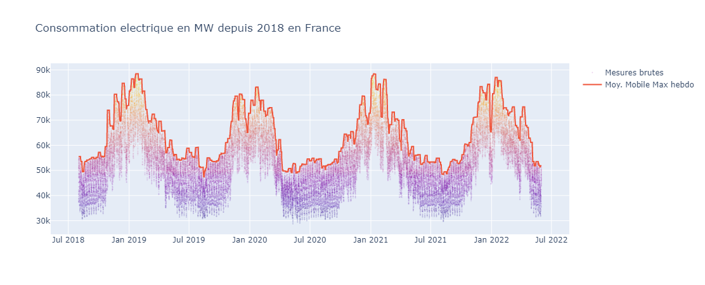
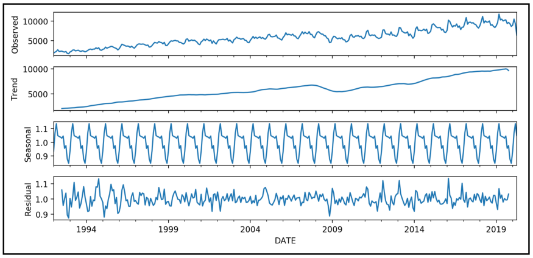
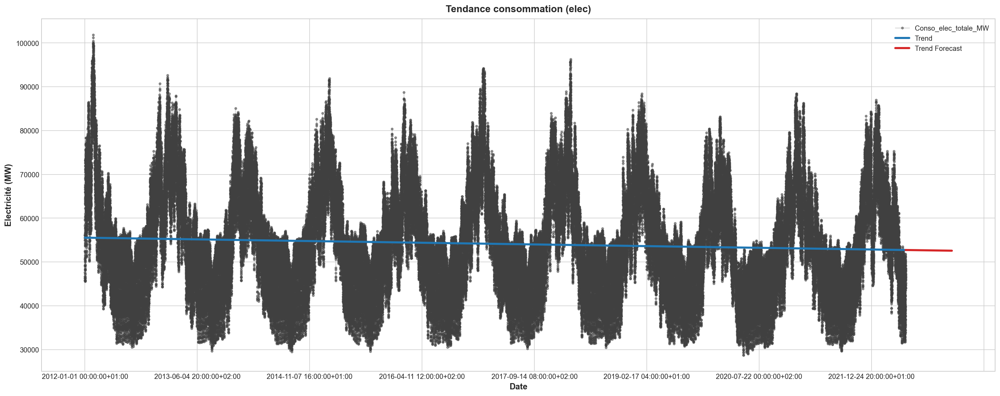
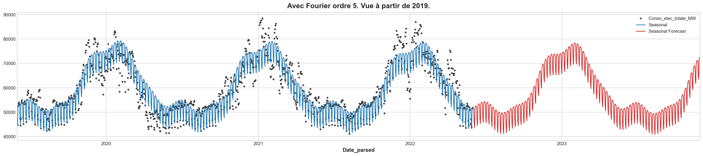
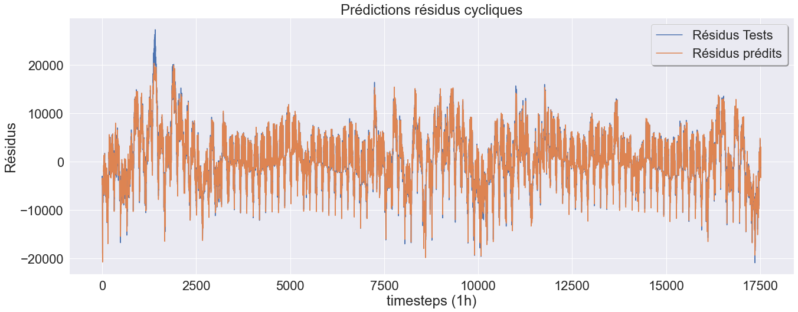
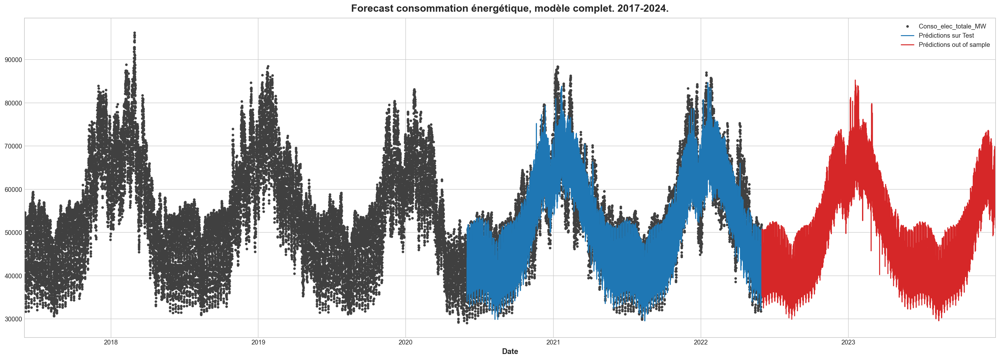

# Prévision de la consommation énergétique à l'horizon 2023 - 2024

 

Prévision du pic de consommation énergétique en France. 
<i>Publié le 1er Août 2022</i>

## Source
Cette étude se base sur le Dataset mis à disposition par ODRE : Open Data Réseaux Energie.
Groupement parmi lequel on retrouve RTE, et GRT Gaz.

Les données comportent les caractéristiques suivantes :
- Granularité à la demi-heure
- Période allant du 1er Janvier 2012, au 31 Mai 2022, au moment de la publication
- Détail fait entre la consommation de gaz, d'électricité, et consommation totale brute

Lien : [open_data_reseaux-energies](https://odre.opendatasoft.com/explore/dataset/consommation-quotidienne-brute/information/?sort=-date_heure&dataChart=eyJxdWVyaWVzIjpbeyJjaGFydHMiOlt7InR5cGUiOiJsaW5lIiwiZnVuYyI6Ik1BWCIsInlBeGlzIjoiY29uc29tbWF0aW9uX2JydXRlX2VsZWN0cmljaXRlX3J0ZSIsInNjaWVudGlmaWNEaXNwbGF5Ijp0cnVlLCJjb2xvciI6IiM2NmMyYTUifV0sInhBeGlzIjoiZGF0ZV9oZXVyZSIsIm1heHBvaW50cyI6bnVsbCwidGltZXNjYWxlIjoiaG91ciIsInNvcnQiOiIiLCJjb25maWciOnsiZGF0YXNldCI6ImNvbnNvbW1hdGlvbi1xdW90aWRpZW5uZS1icnV0ZSIsIm9wdGlvbnMiOnsic29ydCI6Ii1kYXRlX2hldXJlIn19fV0sInRpbWVzY2FsZSI6IiIsInNpbmdsZUF4aXMiOmZhbHNlLCJkaXNwbGF5TGVnZW5kIjp0cnVlLCJhbGlnbk1vbnRoIjp0cnVlfQ%3D%3D)

Aperçu : 

Le profil des données sources est le suivant. 
Extrait à partir de 2018 pour une meilleure visualisation. 
La crête de consommation journalière est en rouge. Les mesures étant à la demi-heure pour la consonmmation électrique.  
<i>Unité GW</i>.  

 

## Conclusions de l'étude prédictive
Le notebook intitulé / **4_Static_Prediction_Residuals.ipynb** / effectue une prédiction à l'horizon du 31/12/2013. 
Sur la base du modèle hybride entraîné(1), nous arrivons à l'estimation suivante :
>Le pic de consommation électrique de l'année 2022 aurait déjà bien eu lieu le 14 Janvier dernier à 87 GW. 
>Le prochain pic hivernal de consommation électrique est estimé survenir **le 18 Janvier 2023, entre 11h et midi**. 
>Il devrait être de **85,2 GW**, au minimum(2). 
>
>C'est une estimation, si elle se vérifie, qui sera en nette baisse par rapport à l'année 2022. 
>Toutefois, elle reste plus elevée que l'hiver 2020, malgré une tendance de consommation énergétique ayant une tendance à la légère baisse.

(1) Ce modèle hybride, aussi appelé 'ensemble' selon la littérature, est une combinaison de deux modèles. 
(2) A minima, car notre modèle à tendance à volontairement sous-evaluer les pics, bien qu'à s'en rapprocher avec le plus de précision possible. 
<i>La MAE (Mean Absolute Error / Erreur Absolue Moyenne) est de +/- 3,02 GW pour ce modèle, en l'état actuel de ses paramètres.</i>

 

## Fonctionnement du modèle

Une série temporelle dite additive peut-être décomposée en plusieurs élements : 
Une tendance, une saisonnalité, et un bruit résiduel. 
En voici un exemple : 

 

Le modèle hybride de ce projet fonctionne de la manière suivante :
  <li>Identification de la <b>tendance</b> avec une régression linéaire</li>
<li>Identification et projection de la <b>saisonnalité</b>, avec une décomposition du signal en transformée de Fourrier. Et régression sur celle-ci</li>

 
### Décomposition du signal avec transformée de Fourier
L'objet de cette étape, et le point fort de cette approche, est de décompser notre saisonnalité en plusieurs fonctions sinusoïdales, d'amplitudes différentes, afin que leur consolidation s'ajuste au mieux à la saisonnalité que nous essayons de capter. 
En image, voici par exemple une décomposition en 4 séries, qui s'adapte à une saisonnalité annuelle. 
 
<i>(chaque courbe de couleur représentant une année)</i>

 

### Prédiction statique ou dynamique
A l'issue du Notebook 3 (Saisonnalité), deux approches pour la prédiction des résidus,et donc du résultat final sont alors possibles : 
<li>Une prévision dynamique, basée sur la correlation partielle et l'auto correlation des données (dans notre cas) de l'heure précédente, du jour précédent, et de la semaine précédente. La limite de cette approche est qu'il n'est pas possible de faire une prédiciton à l'horizon 2024, sur une base horaire, ou alors avec une incertitude (ou erreurs cumulées au fur et à mesure des prédictions) qui n'est pas pertinente. 
Ce modèle est conçu pour être joué toutes les heures, ajuster ses prévisions, et détecter un éventuel emballement de consommation à court-moyen terme.</li> 
<li>Le second modèle, qui utilise <b>LightGBM</b>, un framework d'amplification de gradient basé sur des arbres de décision.pour la prédiction des résidus peut lui se projeter à bien plus long terme, au prix d'une précision moindre.</li>

 

### Etapes réalisées dans les Notebooks

Identification de la Tendance : 

 

Identification de la Saisonnalité : 

 

Prédiction dynamique des Rédidus : 

 

Prédiction statique des Résidus : 

 

Prédiction 31/12/2023 (statique) : 

