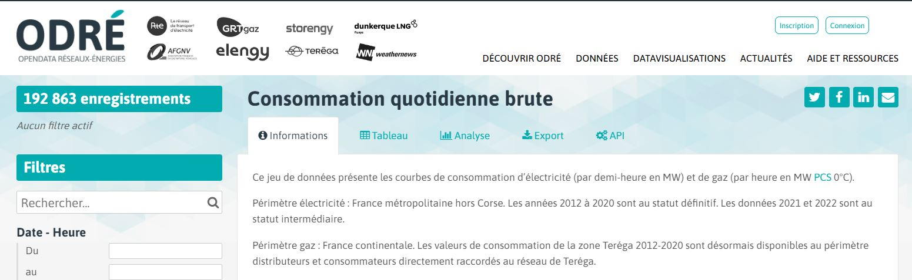

# Prévision de la consommation énergétique à l'horizon 2023 - 2024

 

Prévision du pic de consommation énergétique en France.
<i>Publié le 1er Août 2022</i>

## Source
Cette étude se base sur le Dataset mis à disposition par ODRE : Open Data Réseaux Energie.
Groupement parmi lequel on retrouve RTE, et GRT Gaz.

Les données comportent les caractéristiques suivantes :
- Granularité à la demi-heure
- Période allant du 1er Janvier 2012, au 31 Mai 2022, au moment de la publication
- Détail fait entre la consommation de gaz, d'électricité, et consommation totale brute

Lien : [open_data_reseaux-energies](https://odre.opendatasoft.com/explore/dataset/consommation-quotidienne-brute/information/?sort=-date_heure&dataChart=eyJxdWVyaWVzIjpbeyJjaGFydHMiOlt7InR5cGUiOiJsaW5lIiwiZnVuYyI6Ik1BWCIsInlBeGlzIjoiY29uc29tbWF0aW9uX2JydXRlX2VsZWN0cmljaXRlX3J0ZSIsInNjaWVudGlmaWNEaXNwbGF5Ijp0cnVlLCJjb2xvciI6IiM2NmMyYTUifV0sInhBeGlzIjoiZGF0ZV9oZXVyZSIsIm1heHBvaW50cyI6bnVsbCwidGltZXNjYWxlIjoiaG91ciIsInNvcnQiOiIiLCJjb25maWciOnsiZGF0YXNldCI6ImNvbnNvbW1hdGlvbi1xdW90aWRpZW5uZS1icnV0ZSIsIm9wdGlvbnMiOnsic29ydCI6Ii1kYXRlX2hldXJlIn19fV0sInRpbWVzY2FsZSI6IiIsInNpbmdsZUF4aXMiOmZhbHNlLCJkaXNwbGF5TGVnZW5kIjp0cnVlLCJhbGlnbk1vbnRoIjp0cnVlfQ%3D%3D)

Aperçu : 

## Conclusions de l'étude prédictive
Le notebook intitulé **4_Static_Prediction_Residuals.ipynb** effectue une prédiction à l'horizon du 31/12/2013. 
Sur la base du modèle hybride entraîné(1), nous arrivons à l'estimation suivante :
>Le pic de consommation électrique de l'année 2022 aurait déjà bien eu lieu le 14 Janvier dernier à 87 GW. 
>Le prochain pic hivernal de consommation électrique est estimé survenir **le 18 Janvier 2023, entre 11h et midi**. 
>Il devrait être de **85,2 GW**, au minimum(2). 
>
>C'est une estimation, si elle se vérifie, qui sera en nette baisse par rapport à l'année 2022. 
>Toutefois, elle reste plus elevée que l'hiver 2020, malgré une tendance de consommation énergétique ayant une tendance à la légère baisse.

(1) Ce modèle hybride, aussi appelé 'ensemble' selon la littérature, est une combinaison de deux modèles. 
(2) A minima, car notre modèle à tendance à volontairement sous-evaluer les pics, bien qu'à s'en rapprocher avec le plus de précision possible. 

## Fonctionnement du modèle

